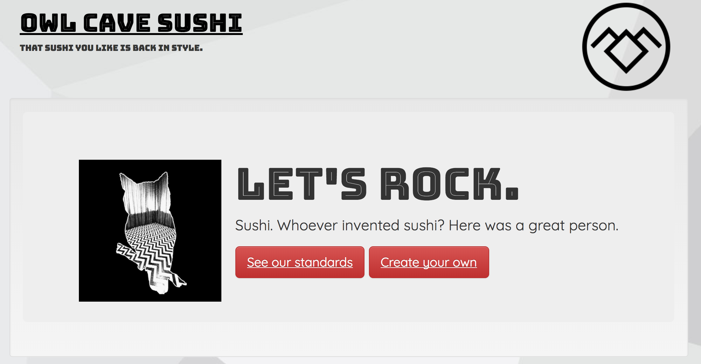
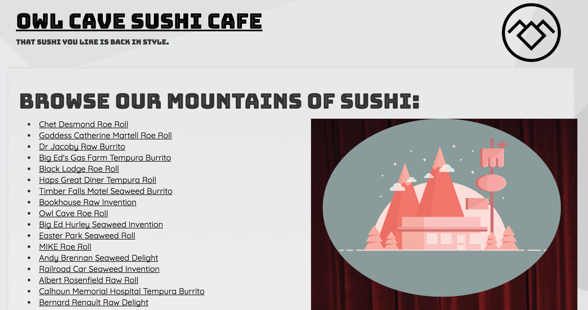
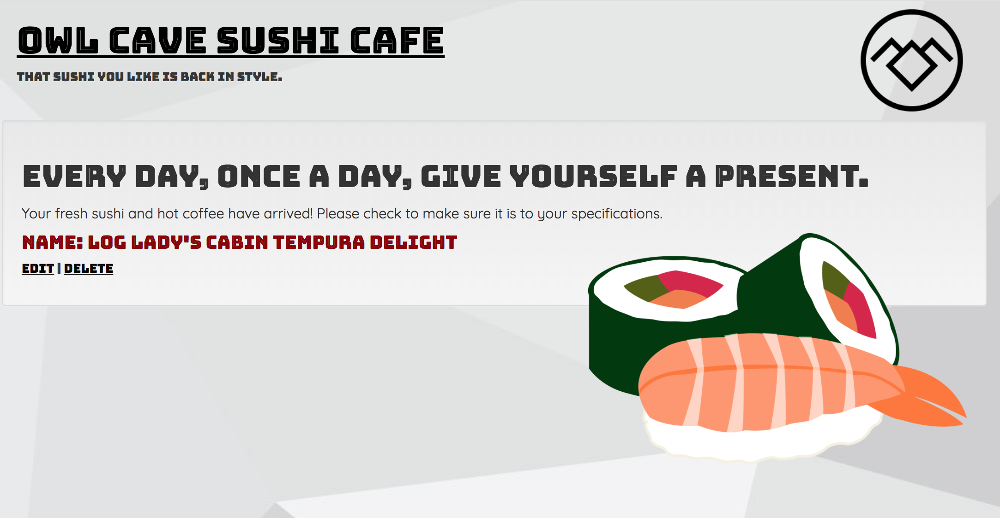
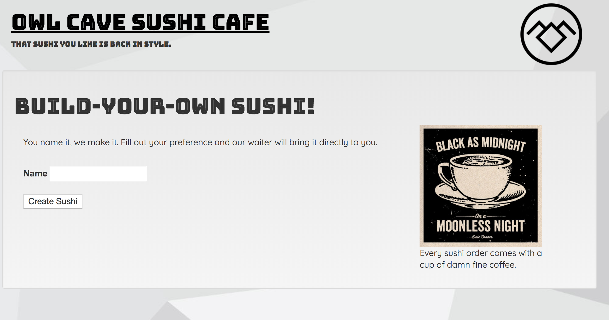
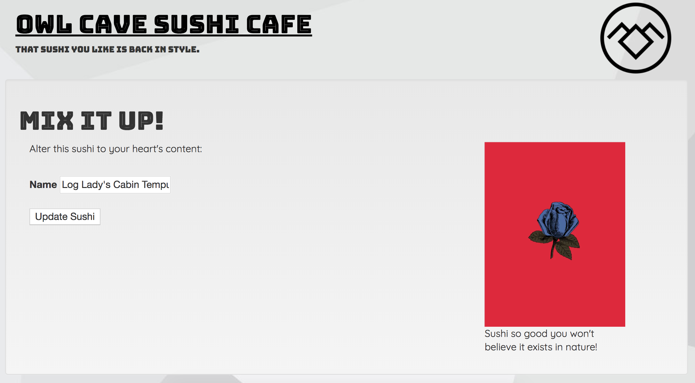

# Owl Cave Sushi Cafe

This is a CRUD app with a workshop and solution branch to practice writing RESTful Routes, corresponding controller actions, and rendering the associated views.

## How to Run

1. Clone down this lab
2. Make sure you're on the "workshop" branch
2. Run `bundle install`
3. Run `rake db:create`
4. Run `rake db:migrate`
5. Run `rake db:seed`
6. Run `rails s`

## Instructions

Now you should be able to access the root at localhost:/3000. [CLICK HERE](https://docs.google.com/presentation/d/e/2PACX-1vSHC0_H0j6UhUMNE-VsHlAC44HS2eSspvqRQy5JL6GSn0nD4rFRRFKW71VCKClR5ffVVwMvyYUwdUJD/pub?start=false&loop=false&delayms=5000) and follow the slides to help this app reach full CRUD actions! You can follow along in the [lecture here](https://youtu.be/vE97XABHMkE).

The pages of the final project should look like the images below:
#### Home

#### Index

#### Show

#### New

#### Edit

